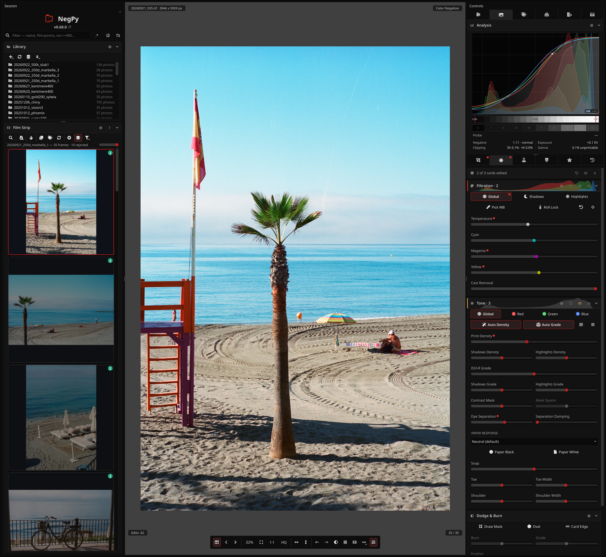

<div align="center">
  <h1>NegPy</h1>

  [](https://github.com/marcinz606/NegPy/actions/workflows/ci.yml)
  [](https://github.com/marcinz606/NegPy/releases)
  [](https://github.com/marcinz606/NegPy/releases)
  [](LICENSE)
  [](pyproject.toml)
  [](https://github.com/astral-sh/ruff)
  [](#getting-started)
  [](https://github.com/marcinz606/NegPy/graphs/contributors)
  [](https://discord.gg/JySNzUWgwy)
</div>

NegPy turns scans of film negatives and slides into finished pictures. I wrote it because I wanted a tool made for film scans that does more than invert them. It models film and photographic paper, and adds the conveniences of a lab scanner on top.

It is written in Python and runs on Linux, macOS and Windows.



The [User Guide](docs/USER_GUIDE.md) covers every panel and control. The same text opens inside the app from the ⓘ on each panel. [PIPELINE.md](docs/PIPELINE.md) explains the math.

## Features

### Conversion

* No camera profiles and no border color picking. The orange mask is removed from each channel's own sensitometry.
* The print is built in density space on an H&D curve with a toe, a straight section and a shoulder, and graded in ISO-R points like darkroom paper.
* Auto Density and Auto Grade meter each frame, so a conversion is usable before you touch a slider. You can set your own targets.
* Paper profiles taken from Ilford, Kodak, Foma and Fuji datasheets.
* Color negative, B&W and slide modes. Slides open as captured, with optional normalization for faded film and HDR merging of bracketed exposures.

### Rolls

* The library is a list of rolls. A roll is a folder you import, or a virtual roll you build from any frames.
* Roll-wide defaults for film mode, crop, calibration, metering, raw decode, lens and metadata. A frame you change stays yours until you push the roll setting back to it.
* Roll Analysis measures the whole roll and gives every frame the same baseline. Scenes split a roll into groups that each get their own.
* Keep/reject triage, half-frame splitting, stitching of multi-shot scans, and search by metadata or (opt-in) by what is in the picture.

### Capture

* Film scanners: Plustek OpticFilm 8200i SE and 8100 V2 over USB, Nikon Coolscan through its own driver, Reflecta and Pacific Image, and anything SANE supports.
* Tethered camera scanning, including red/green/blue narrowband captures with an RGB [Scanlight](https://github.com/jackw01/scanlight). macOS and Linux only. See the [Camera Scanning guide](docs/CAMERA_SCANNING.md).
* Trichrome merge of three narrowband exposures, with sub-pixel alignment.
* Flat-field correction, sensor calibration for narrowband light, and lens correction read from the file.
* Camera RAWs, TIFF, DNG, JPEG XL and scanner formats such as Pakon, Coolscan NEF, Flextight FFF and Noritsu.

### Editing

* Dodge and burn with polygon, oval and card-edge masks. Each mask has its own strength, feather, contrast grade and tone limit.
* Dust, hair and scratch removal: automatic, from the scanner's IR channel (NegPy or OpenICE method), or painted by hand. Heals keep the film grain.
* Darkroom tools: test strips, a color ring-around, a step wedge, a zone overlay, a spot densitometer and zone placement.
* Contrast mask, tilt and swing, edge burn, filed carrier and print mats.
* Lith and cyanotype processes and a set of toners for B&W.
* GPU rendering through Vulkan, Metal or DX12, with a CPU fallback that gives the same result.

### Output

* ICC color management with monitor profile detection and soft proofing for paper and printer profiles.
* Export to JPEG, TIFF, PNG, WebP and JPEG XL, with borders, presets, contact sheets and [filename templates](docs/TEMPLATING.md).
* A flat 16-bit TIFF master for Lightroom, Darktable or Photoshop, or a linear export that skips the pipeline.
* Gear and capture metadata (camera, lens, film, development, date and place) written to EXIF and XMP.

### Your data

* Non-destructive. Source files are never modified.
* Edits live in a local SQLite database keyed by file content, so you can move and rename files. Optional `.negpy` sidecars sit next to the scans.
* Undo history and named work prints survive a restart.
* [Keyboard shortcuts](docs/KEYBOARD.md) can be remapped.

## Getting started

Download the build for your OS from the [Releases page](https://github.com/marcinz606/NegPy/releases). After that, NegPy updates itself: when a new release is out it shows an Update Available notice, and one click downloads and installs it.

To build from source, see [CONTRIBUTING.md](CONTRIBUTING.md).

The builds are not signed. It is a free hobby project and I don't pay Apple or Microsoft for developer certificates, so expect a warning the first time you run it.

### Linux

Make the `.AppImage` executable with `chmod +x` and run it.

Scanning through SANE needs SANE installed. Tethered camera scanning may need `libgphoto2`. The app runs without either.
```
sudo apt install libsane        # Debian/Ubuntu
sudo pacman -S sane libgphoto2  # Arch
```

### Nix

```bash
nix run github:marcinz606/NegPy
```
Or add it as a flake input:
```nix
{
  inputs.negpy.url = "github:marcinz606/NegPy";
  outputs = { self, nixpkgs, negpy, ... }: {
    # negpy.packages.<system>.default
  };
}
```

### macOS

1. Open the `.dmg` and drag NegPy to `/Applications`.
2. Run `xattr -cr /Applications/NegPy.app` in Terminal to clear the warning.
3. Launch it.

SANE scanning and camera scanning use [Homebrew](https://brew.sh/) packages. The app runs without them.
```
brew install sane-backends libgphoto2
```

To build the DMG yourself, set `NEGPY_MACOS_ARCH=x86_64` for Intel or `NEGPY_MACOS_ARCH=arm64` for Apple Silicon.

### Windows

Run the installer and click through the warnings.

Plustek OpticFilm 8200i SE and 8100 V2 scanners need the WinUSB driver. Install it with [Zadig](https://zadig.akeo.ie/) in place of the SilverFast driver (`07b3:1825` for the 8200i SE, `07b3:1824` for the 8100 V2). The release build includes everything else. See [PLUSTEK_WINDOWS.md](docs/PLUSTEK_WINDOWS.md). Camera scanning is not available on Windows, because libgphoto2 has no Windows build.

## Data location

Everything is in `Documents/NegPy`. On Windows, if that folder is blocked, NegPy asks for another one and suggests Local AppData. The `NEGPY_USER_DIR` environment variable overrides both.

* `edits.db`: your edits.
* `settings.db`: app settings such as the last export settings.
* `cache/`: thumbnails. Safe to delete.
* `export/`: default export folder.
* `icc/`: paper and printer profiles.
* `override.toml`: startup overrides, see below.

## Troubleshooting

If NegPy crashes on startup or renders wrong, edit `override.toml`. NegPy writes it on first run with defaults for your OS. Most `[performance]` values are also in Preferences (`Ctrl + ,`), but the file wins, so you can fix things when the app will not start.

```toml
[rendering]
# Options: "auto", "vulkan" (Linux/Win), "dx12" (Win), "metal" (macOS), "cpu"
backend = "vulkan"

[display]
# Qt scene-graph backend. Options: "auto", "vulkan", "d3d12", "metal", "opengl", "software"
qt_rhi_backend = "auto"

# Window system plugin (Linux only). Options: "auto", "xcb", "wayland"
qt_platform = "auto"

[performance]
# Cap GPU texture size in pixels — useful on low-VRAM cards. "auto" = no limit.
max_texture_size = "auto"

# Force HQ preview on/off. Uncomment to override saved preference.
# force_hq_preview = false

# Long edge of the interactive preview in pixels (512-8192). Higher is a sharper
# canvas and more VRAM per frame.
# preview_render_size = 1600

# Preview cache size — keeps recently-viewed photos in memory for instant navigation.
# Lower these on low-RAM machines. Uncomment to override defaults (~1.2 GB / 8 photos).
# preview_cache_max_bytes = 1200000000
# preview_cache_max_entries = 8

[logging]
# "debug", "info", "warning", "error"
level = "info"
```

`backend = "cpu"` turns GPU rendering off, for when the GPU backend crashes on your hardware.

## More

* [Roadmap](docs/ROADMAP.md)
* [Changelog](docs/CHANGELOG.md)
* [Contributing](CONTRIBUTING.md)

## License

[GPL-3](LICENSE).

## Support

If you like NegPy, buy me a roll of film so I have more test data :)

[](https://ko-fi.com/marcinzawalski)
