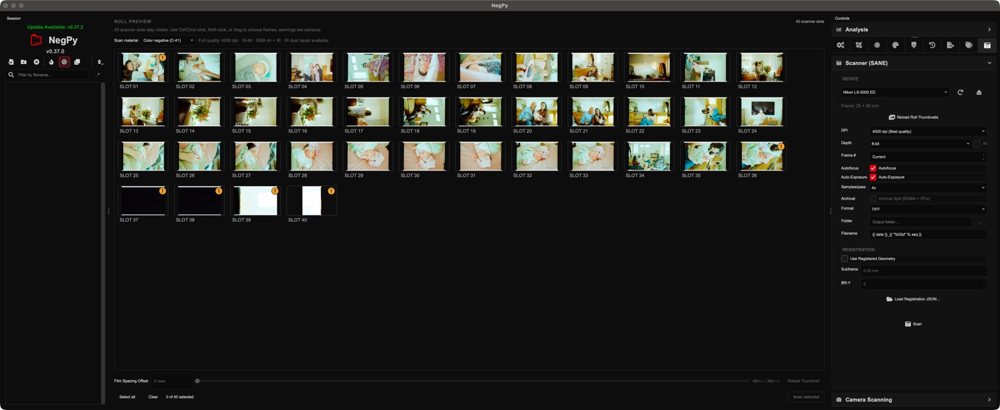

# Nikon LS-5000 roll scanning

NegPy can read a whole roll in the Nikon LS-5000, show small previews, and scan the frames you choose. The saved TIFFs are linear negative masters. NegPy applies inversion and editing later, so a scan does not bake in a look.

## What you need

- A Nikon LS-5000 ED running firmware 1.03.
- An SA-30, or an adapter that reports the same 40-slot roll capacity.
- The patched `coolscan3` SANE driver. The black-and-white path depends on its frame, subframe, full-window, auto-exposure, and multisampling controls.
- Direct USB access on macOS or Linux.

The 40 slots are positions the feeder can address. They are not an exposure count. A 24 or 36 exposure roll can end with blank, partial, or otherwise unusable slots.

## Preview and select a roll

1. Insert the film and open the Scan panel.
2. Choose the LS-5000 and click **Load Roll Thumbnails**. The feeder travels across the roll once and NegPy places a contact sheet in the main workspace.
3. Choose **Color negative (C-41)** or **Black-and-white negative**.
4. Select the frames you want. Ctrl-click, Cmd-click, Shift-click, and drag selection all work.
5. Click **Scan selected**.

Warnings on the last few slots are advisory. They usually mean that the preview looks blank, partial, or uncertain. Check the thumbnail before including one in a full scan.

The contact sheet uses its own display levels so that dense negatives and the orange mask remain readable. Those levels do not change scanner auto-exposure or the pixels written to the TIFF.

## Fix a frame boundary

**Film Spacing Offset:** Use this when a thumbnail cuts into the photograph or includes too much of the next frame. The signed number and slider both start at zero. Negative values move the frame left and positive values move it right. With the contact sheet focused, `Alt+Left` and `Alt+Right` change the value one row at a time.

- Slot 1 accepts offsets from 0 to 144. Later slots accept -144 to 144.

Click **Reload Thumbnail** after changing the value. NegPy recrops that frame from the saved whole-roll preview and resolves the same offset through the scanner's transport table. An edited frame cannot be scanned until the matching reloaded thumbnail has returned. This prevents an unreviewed offset from reaching a full-quality scan.

If you eject or reinsert the film, or power-cycle the scanner, load the whole roll again. Frame coordinates belong to one insertion and must not be reused after the film moves.

## Full-quality capture

| Material | Scanner capture | Infrared | Import behavior |
| --- | --- | --- | --- |
| Color negative (C-41) | 4000 dpi, 16-bit, RGB 4x | One scanner IR plane | C-41 mode, IR dust repair on |
| Conventional silver B&W | 4000 dpi, 16-bit, RGB 4x | Off | B&W mode, IR dust repair off |

Color scans produce four files with the same base name:

- The RGB negative master: `.tif`
- The scanner IR plane: `_IR.tif`
- A mask that marks valid IR samples: `_IR_VALID.tif`
- A scan receipt: `_SCAN.json`

The RGB and IR files come from one scanner traversal. NegPy averages four transferred RGB samples. The packed stream carries one IR plane. The scanner may combine IR samples in firmware, but the wire data does not prove that, so NegPy records its IR multisample semantics as unresolved.

Black-and-white scans produce one RGB TIFF. NegPy does not request IR, create an IR sidecar, or enable IR dust repair. Silver blocks infrared light, so an IR defect map cannot distinguish dust from the photograph. Chromogenic black-and-white films such as Ilford XP2 are different. Scan those as C-41 if you want to use IR dust removal.

Both routes use autofocus and hardware auto-exposure on the positioned frame. NegPy checks the requested geometry before capture and verifies the dimensions, bit depth, resolution, and transport-smear result before accepting the TIFF. Large packed capture files are scratch data and are removed after the verified color TIFF set is complete.

The resolution menu marks the highest resolution reported by the selected scanner as **Best quality** and selects it when you choose the scanner. You can still pick a lower resolution for a faster scan.

Each selected color frame currently opens its own direct scanner session. The scanner may travel across the roll again before the next frame. This is slower than Nikon Scan's long-lived batch session, but it does not change the saved image data.

## Stopping and recovery

**Stop after current frame** lets the active scanner transaction finish, then prevents the next selected frame from starting. Frames completed before a stop or later error remain in the output folder and are imported into NegPy.

If a USB failure leaves the feeder in an uncertain state, NegPy stops the queue and asks for a power cycle. Load the roll thumbnails again after recovery.

Use the **Eject** button beside the scanner selector when the device reports an eject control. A successful eject clears the contact sheet because its frame coordinates no longer belong to the film's current position.

The direct C-41 preview sequence can wake a parked roll feeder. The SANE black-and-white route cannot yet do that reliably. If a parked black-and-white session reports zero frames, power-cycle the scanner, reinsert the film, and load the roll again before scanning.
